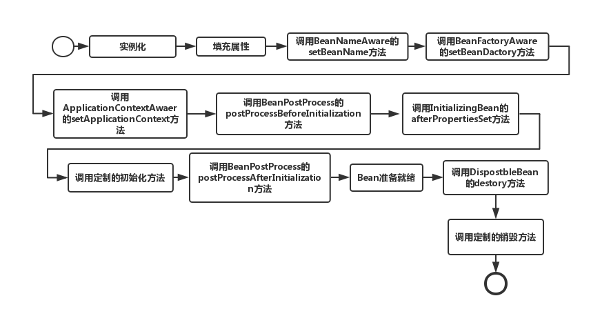

# 毕业总结
感慨一下，跟秦老师学习的这一段时间真是每天都增加新的认知，包括技术上的和生活上的，既有硬知识，又有软实力。由于晚上经常加班，大部分都是看重播，好些内容没有认知仔细听，没有练习。
接下来半年消化掉，慢慢来吧。`每天进步一点点，努力就会到终点`。  

## 知识总结
#### JVM  
JVM主要知识点主要包含以下几个：

- 字节码：JVM执行的实际是二进制的字节码，也就是.class文件

- 内存模型：JVM 内存共分为虚拟机栈，堆，方法区，程序计数器，本地方法栈五个部分。其中堆区域属于线程共享区域，即同一个Java进程里的所有线程共享堆内存。堆内存中放的是所有new出来的对象，同时，为了方便进行垃圾回收，根据对象的存活时间，将堆内存分为了新生代和老年代；栈区域属于线程私有，每启动一个线程便会开启一块区域作为该线程私有；方法区主要放了静态方法和常理，属于线程共享区域；程序计数器存在于线程的栈中，作为程序执行到第几行的一个计数器；

- 类加载：虚拟机把描述类的数据从 Class 文件加载到内存，并对数据进行校验、转换解析和初始化，最终形成可以被虚拟机直接使用的 数据类型，这就是虚拟机的类加载机制。这里面需要注意的是

  1. 类加载过程：加载 -> 验证 ->  准备 -> 解析 -> 初始化
  2. 类加载时机：遇到new、getstatic 和 putstatic 或 invokestatic 这4条字节码指令时；对类进行反射调用的时候；当初始化类的父类还没有进行过初始化；虚拟机启动时加载包含 main() 方法的那个类
  3. 类加载器
  4. 双亲委派模型

- 垃圾回收

  - 垃圾回收主要树针对堆内存来说的。

  - 通过可达性算法判断对象是否存活，GCRoot节点一般包括虚拟机栈(栈桢中的本地变量表)中的引用的对象 ；方法区中的类静态属性引用的对象 ；方法区中的常量引用的对象 。

  - 垃圾回收算法：根据堆内存不同区域的划分，采用不同的算法，新生代是标记-复制算法，简单粗暴效率高，老年代采用标记-清除-整理算法，比较费时，一般需要避免
  - 各种GC对比，以及发展趋势：因为互联网快速相应的要求，GC也朝着尽可能减少一次GC特变慢的情景发展

- 性能监控与调优

  JVM监控工具一般就是JCM这种，调优的话要根据业务场景来看，结合监视工具，具体问题具体分析。

#### NIO

- 阻塞与非阻塞

  阻塞与非阻塞是描述进程在访问某个资源时，数据是否准备就绪的的一种处理方式。当数据没有准备就绪时：

  - 阻塞：线程持续等待资源中数据准备完成，直到返回响应结果。
  - 非阻塞：线程直接返回结果，不会持续等待资源准备数据结束后才响应结果。

- 同步与异步

  - 同步与异步是指访问数据的机制，同步一般指主动请求并等待IO操作完成的方式。
  - 异步则指主动请求数据后便可以继续处理其它任务，随后等待IO操作完毕的通知。

- [五种IO模型](https://mp.weixin.qq.com/s?__biz=Mzg3MjA4MTExMw==&mid=2247484746&idx=1&sn=c0a7f9129d780786cabfcac0a8aa6bb7&source=41#wechat_redirect)

- NIO是一种同步非阻塞模型，主要有三大核心部分：Channel(通道)，Buffer(缓冲区), Selector（多路复用器）。

- 传统IO基于字节流和字符流进行操作，而NIO基于Channel和Buffer(缓冲区)进行操作，数据总是从通道读取到缓冲区中，或者从缓冲区写入到通道中。

- Selector(多路复用器)用于监听多个通道的事件（比如：连接打开，数据到达）。因此，单个线程可以监听多个数据通道。

#### 并发编程

- 为什么需要并发编程
  1. 为了更好发挥多核处理器的性能
  2. 为了弥补CPU，内存，和硬盘处理数据速度上的差异
- 并发编程带来的问题
  1. 线程安全问题
- 并发编程需要保证的特性：原子性，可见性，有序性
  - 原子性：多个操作指令作为一个整体，要么全部执行，要么都不执行。这个**可以通过锁、synchronized来确保**。
  - 可见性：当多个线程访问同一个变量时，一个线程修改了这个变量的值，其他线程能够立即看得到修改的值。**volatile关键字**
  - 有序性：程序执行的顺序按照代码的先后顺序执行。处理器为了提高程序运行效率，可能会对输入代码进行优化，它不保证程序中各个语句的执行先后顺序同代码中的顺序一致，但是它会保证程序最终执行结果和代码顺序执行的结果是一致的，这就是指令重排。**volatile关键字**

#### Spring和ORM框架

- Spring核心是Ioc（控制反转）和AOP（切面编程）。

- 控制反转是将Bean的管理交给Spring容器，通过依赖注入和依赖查找来满足我们对Bean的管理。

- 切面编程是对面向对象编程的一种补充加强

- Spring Bean的生命周期

  

- Spring Boot约定大于配置，开箱即用

- ORM是一种关系映射模式，是为了解决面向对象与关系数据库存在的互不匹配的现象的技术。

#### MySQL数据库和SQL

- MySQL索引
  - 聚簇索引和非聚簇索引

- MySQL存储引擎：**InnoDB **  VS  **MyISAM**
  - 一个支持事务，一个不支持事务；
  - 一个适用于数据处理，一个适用于数据分析。
- SQL优化技巧
  - 慢SQL分析
  - 索引失效问题

#### 分库分表

- 分库分表原则

  - 垂直拆分：根据业务耦合性，按照业务分类进行独立划分。如果单表字段太多，拆分为多表；也可以将关联关系低的表分不同数据库存储。
  - 水平拆分：当一个应用难以再细粒度的垂直切分，或切分后数据量行数巨大，存在单库读写、存储性能瓶颈，这时候就需要进行水平切分了。水平切分分为库内分表和分库分表，是根据表内数据内在的逻辑关系，将同一个表按不同的条件分散到多个数据库或多个表中，每个表中只包含一部分数据，从而使得单个表的数据量变小，达到分布式的效果。
  - 分片规则：根据实际业务场景，可以按照ID，时间戳等字段设置规则。

- 什么情况下分表

  单表IO，容量等达到瓶颈，可以考虑分表。

- 什么情况下分库

  如果分表还是解决不了问题，再考虑分库。分库成本就太大，要考虑分布式相关的一些东西。

#### RPC和微服务

##### RPC

- RPC（Remote Procedure Call）远程过程调用，简单的理解是一个节点请求另一个节点提供的服务
- 客户端需要知道调用的方法名和地址
- 服务端需要将接口提供出去
- 在微服务的设计中，一个服务A如果访问另一个Module下的服务B，可以采用HTTP REST传输数据，并在两个服务之间进行序列化和反序列化操作，服务B把执行结果返回过来。
- 由于HTTP在应用层中完成，整个通信的代价较高，远程过程调用中直接基于TCP进行远程调用，数据传输在传输层TCP层完成，更适合对效率要求比较高的场景，RPC主要依赖于客户端和服务端之间建立Socket链接进行，底层实现比REST更复杂。

##### 微服务

一个系统的用户访问量越来越大，单个服务器无法支撑了，需要多台服务器来提高性能。单纯的多台服务器来提供相同服务，这叫集群。将不同业务拆分为多台服务器，这就是微服务。

- 单一职责：‘微’的体现，一个服务解决一个单一的业务问题。

- 面向服务：将自己的业务能力封装并对外提供服务，这是继承SOA的核心思想，一个微服务本身也可能使用到其它微服务的能力。

- 应用微服务化之后，通过**服务注册中心**，将自己的服务能力暴漏出来，同时也可以从注册中心获取可用服务清单。

- 通过**配置中心**将所有微服务统一管理，统一配置。

- 再就是通过熔断、限流等机制保证高可用；通过分布式事务保证数据一致性

- 转载[Spring Cloud入门总结](https://juejin.cn/post/6844904007975043079)

#### 分布式缓存

因为内存的读写速度远快于硬盘，可内存容量和成本高于硬盘，折中选择，部分热数据缓存在内存中，因此缓存计数应运而生。

- 缓存更新机制

  - Cache Aside模式

    1. 读取失效：cache数据没有命中，查询DB，成功后把数据写入缓存
    2. 读取命中：读取cache数据
    3. 更新：把数据更新到DB，失效缓存

  - Read/Write Through模式

    缓存代理了DB读取、写入的逻辑，可以把缓存看成唯一的存储。

  - Write Back模式

    这种模式下所有的操作都走缓存，缓存里的数据再通过异步的方式同步到数据库里面。所以系统的写性能能够大大提升了。

- 缓存失效策略

  一般而言，缓存系统中都会对缓存的对象设置一个超时时间，避免浪费相对比较稀缺的缓存资源。对于缓存时间的处理有两种，分别是主动失效和被动失效。

  - 主动失效是指系统有一个主动检查缓存是否失效的机制，比如通过定时任务或者单独的线程不断的去检查缓存队列中的对象是否失效，如果失效就把他们清除掉，避免浪费。主动失效的好处是能够避免内存的浪费，但是会占用额外的CPU时间。

  - 被动失效是通过访问缓存对象的时候才去检查缓存对象是否失效，这样的好处是系统占用的CPU时间更少，但是风险是长期不被访问的缓存对象不会被系统清除。

  缓存淘汰，又称为缓存逐出(cache replacement algorithms或者cache replacement policies)，是指在存储空间不足的情况下，缓存系统主动释放一些缓存对象获取更多的存储空间。

  - FIFO：先进先出（First In First Out）是一种简单的淘汰策略，缓存对象以队列的形式存在，如果空间不足，就释放队列头部的（先缓存）对象。一般用链表实现。
  - LRU：最近最久未使用（Least Recently Used），这种策略是根据访问的时间先后来进行淘汰的，如果空间不足，会释放最久没有访问的对象（上次访问时间最早的对象）。比较常见的是通过优先队列来实现。
  - LFU：最近最少使用（Least Frequently Used），这种策略根据最近访问的频率来进行淘汰，如果空间不足，会释放最近访问频率最低的对象。这个算法也是用优先队列实现的比较常见。

- 分布式缓存常见问题

  - 缓存击穿
    - 在缓存失效的瞬间大量请求，造成DB的压力瞬间增大
    - 解决方案：更新缓存时使用分布式锁锁住服务，防止请求穿透直达DB
  - 缓存穿透
    - DB中不存在数据，每次都穿过缓存查DB，造成DB的压力。一般是网络攻击
    - 解决方案：放入一个特殊对象（比如特定的无效对象，当然比较好的方式是使用包装对象）
  - 缓存雪崩
    - 大量缓存设置了相同的失效时间，同一时间失效，造成服务瞬间性能急剧下降
    - 解决方案：缓存时间使用基本时间加上随机时间

#### 分布式消息队列

- 异步处理：两个系统之间进行数据交互，把数据直接交给消息队列，不需要等对方系统处理完数据再返回，实现异步处理。

- 数据解耦：两个系统要进行数据交换，不再直接调用，通过消息队列完成解耦。

- 削峰填谷：并发量高的时候，可以把数据放在消息队列中，后面慢慢处理就好了，使系统运行更加平滑

- 常用框架：

  - ActiveMQ 的社区算是比较成熟，但是较目前来说，ActiveMQ 的性能比较差，而且版本迭代很慢，不推荐使用。

  - RabbitMQ 在吞吐量方面虽然稍逊于 Kafka 和 RocketMQ ，但是由于它基于 erlang 开发，所以并发能力很强，性能极其好，延时很低，达到微秒级。但是也因为 RabbitMQ 基于 erlang 开发，所以国内很少有公司有实力做erlang源码级别的研究和定制。如果业务场景对并发量要求不是太高（十万级、百万级），那这四种消息队列中，RabbitMQ 一定是你的首选。如果是大数据领域的实时计算、日志采集等场景，用 Kafka 是业内标准的，绝对没问题，社区活跃度很高，绝对不会黄，何况几乎是全世界这个领域的事实性规范。

  - RocketMQ 阿里出品，Java 系开源项目，源代码我们可以直接阅读，然后可以定制自己公司的MQ，并且 RocketMQ 有阿里巴巴的实际业务场景的实战考验。RocketMQ 社区活跃度相对较为一般，不过也还可以，文档相对来说简单一些，然后接口这块不是按照标准 JMS 规范走的有些系统要迁移需要修改大量代码。还有就是阿里出台的技术，你得做好这个技术万一被抛弃，社区黄掉的风险，那如果你们公司有技术实力我觉得用RocketMQ 挺好的

  - kafka 的特点其实很明显，就是仅仅提供较少的核心功能，但是提供超高的吞吐量，ms 级的延迟，极高的可用性以及可靠性，而且分布式可以任意扩展。同时 kafka 最好是支撑较少的 topic 数量即可，保证其超高吞吐量。kafka 唯一的一点劣势是有可能消息重复消费，那么对数据准确性会造成极其轻微的影响，在大数据领域中以及日志采集中，这点轻微影响可以忽略这个特性天然适合大数据实时计算以及日志收集。
